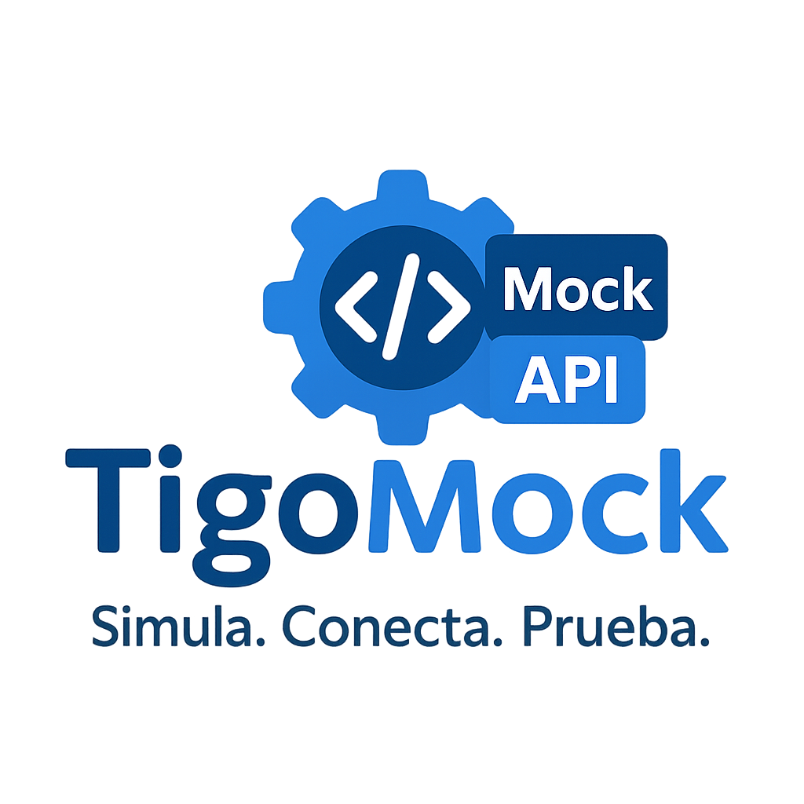

<p align="center">
    
</p>

<h3 align="center">Tigo Challenge - API-based app intented for mocks of REST services</h3>
<hr/>

<p align="center">
  <a href="https://github.com/marcosbondel/tigo_challenge_bondel/releases/tag/v0.7.0">
    
  </a>
  
  <a href="https://www.postman.com/speeding-space-649752/bondel/collection/k5oc1u1/tigo-challenge?action=share&creator=22124311&active-environment=22124311-c6ed0b54-6dac-42c3-a3c0-48536876bf70">
    
  </a>
  <a href="./license">
    
  </a>
</p>

<p align="center">
<i> Documentation generated with the help of AI </i>
</p>

---

## 🌟 Características Destacadas

Este proyecto no es un simple mock estático. Aquí te presento algunas de sus capacidades avanzadas:

* **Respuestas Dinámicas:** A diferencia de los mocks tradicionales, las respuestas HTTP no están codificadas. Se procesan dinámicamente por el controlador y se mapean directamente desde colecciones en **MongoDB Atlas**, proporcionando una flexibilidad inigualable.
* **Despliegue en la Nube:** La aplicación está desplegada en un entorno productivo en una instancia **EC2 de AWS**, con el clúster de base de datos configurado en **MongoDB Atlas**, garantizando accesibilidad y escalabilidad.

---

### 🌐 Demo en Vivo

Explora la funcionalidad completa de la API con nuestra colección de Postman:

[**Postman Tigo Challenge - Bondel Collection**](https://www.postman.com/speeding-space-649752/bondel/collection/k5oc1u1/tigo-challenge?action=share&creator=22124311&active-environment=22124311-c6ed0b54-6dac-42c3-a3c0-48536876bf70)

---

### 📄 Requerimientos Originales

Puedes consultar los requerimientos iniciales del proyecto [aquí](./docs/requirements.md).

---

## 📖 Tabla de Contenidos

- [🌟 Características Destacadas](#-características-destacadas)
  - [🌐 Demo en Vivo](#-demo-en-vivo)
  - [📄 Requerimientos Originales](#-requerimientos-originales)
- [📖 Tabla de Contenidos](#-tabla-de-contenidos)
- [📂 Estructura de la Aplicación](#-estructura-de-la-aplicación)
- [🚀 Instalación Local](#-instalación-local)
  - [🖥️ Requisitos del Sistema](#️-requisitos-del-sistema)
    - [🔧 Requerimientos de Software](#-requerimientos-de-software)
    - [💻 Requerimientos de Hardware](#-requerimientos-de-hardware)
  - [📝 Pasos de Instalación](#-pasos-de-instalación)
    - [1. Clona el Repositorio](#1-clona-el-repositorio)
    - [2. Instala las Dependencias](#2-instala-las-dependencias)
    - [3. Configura las Variables de Entorno](#3-configura-las-variables-de-entorno)
    - [4. Ejecuta la Aplicación en Modo Desarrollo](#4-ejecuta-la-aplicación-en-modo-desarrollo)
    - [🧪 Ejecuta las Pruebas](#-ejecuta-las-pruebas)
    - [✅ ¡Listo!](#-listo)
- [📝 Documentación de la API](#-documentación-de-la-api)
  - [1. Endpoints de Configuración de Mocks](#1-endpoints-de-configuración-de-mocks)
    - [1.1. Obtener Información de la Aplicación](#11-obtener-información-de-la-aplicación)
    - [1.2. Listar Configuraciones de Mocks](#12-listar-configuraciones-de-mocks)
    - [1.3. Obtener Configuración de Mock por ID](#13-obtener-configuración-de-mock-por-id)
    - [1.4. Crear Configuración de Mock](#14-crear-configuración-de-mock)
    - [1.5. Actualizar Configuración de Mock](#15-actualizar-configuración-de-mock)
    - [1.6. Eliminar Configuración de Mock](#16-eliminar-configuración-de-mock)
  - [2. Endpoints de Recursos Dinámicos](#2-endpoints-de-recursos-dinámicos)
    - [2.1. Listar Recursos Dinámicos](#21-listar-recursos-dinámicos)
    - [2.2. Obtener Recurso Dinámico por ID](#22-obtener-recurso-dinámico-por-id)
    - [2.3. Crear Recurso Dinámico](#23-crear-recurso-dinámico)
    - [2.4. Actualizar Recurso Dinámico](#24-actualizar-recurso-dinámico)
    - [2.5. Eliminar Recurso Dinámico](#25-eliminar-recurso-dinámico)
- [🛡️ Tokens de Acceso](#️-tokens-de-acceso)
- [🧪 Ejemplo de Prueba con `curl`](#-ejemplo-de-prueba-con-curl)
- [🤖 Uso de Herramientas de IA](#-uso-de-herramientas-de-ia)
- [📜 Licencia](#-licencia)

---

## 📂 Estructura de la Aplicación

```
.
├── config
│   ├── app.js
│   ├── database.js
│   ├── index.js
│   └── server.js
├── controllers
│   ├── index.js
│   ├── mocks\_controller.js
│   └── resources\_controller.js
├── docs
│   ├── api.md
│   ├── english.md
│   ├── requirements.md
│   ├── spanish.md
│   └── tigo\_logo.png
├── index.js
├── license
├── logs
│   ├── development.log
│   └── test.log
├── middlewares
│   ├── index.js
│   └── validators.js
├── models
│   ├── index.js
│   └── mock\_model.js
├── package-lock.json
├── package.json
├── readme.md
├── routes
│   ├── index.js
│   ├── mock\_routes.js
│   └── resource\_routes.js
├── system
│   ├── http\_responder.js
│   ├── index.js
│   ├── jwt.js
│   └── logger.js
├── tests
│   ├── controllers
│   │   └── mocks\_controller.test.js
│   └── helper.js
└── utils
├── compare.js
├── index.js
└── validators.js

```

---

## 🚀 Instalación Local

### 🖥️ Requisitos del Sistema

Antes de instalar este proyecto, asegúrate de cumplir con los siguientes requerimientos mínimos:

#### 🔧 Requerimientos de Software

* **Node.js**: Versión `v18` o superior
* **npm**: Versión `v9` o superior
* **MongoDB**: Acceso a un clúster en MongoDB Atlas o una instancia local (versión `5.0` o superior).
* **Sistema Operativo**: Linux, macOS, o Windows (se recomienda **WSL** en Windows para una mejor experiencia).

#### 💻 Requerimientos de Hardware

* **CPU**: 1 núcleo (recomendado: 2 o más)
* **RAM**: 512 MB (recomendado: 2 GB)
* **Almacenamiento**: 200 MB libres para dependencias del proyecto y la base de datos.
* **Conexión a Internet**: Necesaria para la instalación de dependencias y la conexión a MongoDB Atlas.

---

### 📝 Pasos de Instalación

Sigue estos sencillos pasos para tener la aplicación funcionando en tu entorno local:

#### 1. Clona el Repositorio

Para clonar el proyecto, te recomendamos usar el protocolo **SSH** para una autenticación más segura con GitHub:

```bash
git clone git@github.com:marcosbondel/tigo_challenge_bondel.git
```

> 💡 **Tip:** Si no tienes SSH configurado, también puedes usar HTTPS:
> `git clone https://github.com/marcosbondel/tigo_challenge_bondel.git`

-----

#### 2\. Instala las Dependencias

Navega hasta la carpeta del proyecto y ejecuta el comando para instalar todas las dependencias necesarias:

```bash
cd tigo_challenge_bondel
npm install
```

-----

#### 3\. Configura las Variables de Entorno

Para una gestión segura y flexible de las credenciales y configuraciones por entorno (desarrollo, pruebas y producción), crea los siguientes archivos en la **raíz de tu proyecto**:

  * `.env.development`
  * `.env.test`
  * `.env.production`

Aquí tienes un ejemplo del contenido para `.env.development`:

```env
SERVER_PORT=3001
MONGODB_URI=mongodb://localhost:27017/bondel_challenge_development
MONGODB_DB_NAME=bondel_challenge_development
JWT_SECRET=011235813
JWT_EXPIRATION=1h
```

> ⚠️ **Importante:** Asegúrate de que estos archivos `.env` **no sean subidos a GitHub**. Ya están correctamente ignorados en el archivo `.gitignore` del repositorio.

-----

#### 4\. Ejecuta la Aplicación en Modo Desarrollo

Una vez configuradas tus variables de entorno, inicia la aplicación en modo desarrollo:

```bash
npm run dev
```

Deberías ver una salida similar a esta en tu consola:

```bash
> tigo_challenge_bondel@1.0.0 dev
> NODE_ENV=development nodemon index.js

[nodemon] starting `node index.js`
[dotenv@17.2.0] injecting env (12) from .env.development
HTTP server is listening on port: 3001
Mongoose online
```

-----

#### 🧪 Ejecuta las Pruebas

Para verificar que todo funciona correctamente y que el código base es estable, puedes ejecutar los tests del proyecto con el siguiente comando:

```bash
npm run test
```

Este comando utilizará el entorno de pruebas (`.env.test`) y ejecutará todos los archivos que terminen en `*.test.js` dentro de la carpeta `tests`.

-----

#### ✅ ¡Listo\!

¡Felicidades\! Tu API ya debería estar funcionando y lista para recibir solicitudes en:

**[http://localhost:3001/](https://www.google.com/search?q=http://localhost:3001/)**

-----

## 📝 Documentación de la API

Esta sección detalla todos los endpoints disponibles en la aplicación, incluyendo sus parámetros y las posibles respuestas. La API se divide en dos categorías principales: **Configuración de Mocks** y **Recursos Dinámicos**.

-----

### 1\. Endpoints de Configuración de Mocks

Estos endpoints se utilizan para gestionar las configuraciones de los mocks de la API.

#### 1.1. Obtener Información de la Aplicación

Obtiene información básica sobre la aplicación.

  * **Endpoint:** `GET /`
  * **Parámetros:** Ninguno
  * **Respuestas:**
      * **200 OK**
        ```json
        {
          "status": "ok",
          "name": "nombre_de_la_aplicacion",
          "version": "version_de_la_aplicacion",
          "description": "descripcion_de_la_aplicacion",
          "keywords": ["keyword1", "keyword2"]
        }
        ```

#### 1.2. Listar Configuraciones de Mocks

Obtiene una lista de todas las configuraciones de mocks existentes.

  * **Endpoint:** `GET /configure-mock`
  * **Parámetros:** Ninguno
  * **Respuestas:**
      * **200 OK**
        ```json
        {
          "data": [
            {
              "_id": "60d0fe4f5b5e1a001c8c4c0f",
              "resource": "users",
              "version": "v1",
              "method": "GET",
              "headers": [],
              "query_params": ["name", "email"],
              "body_params": [],
              "content_type": "application/json",
              "status": "enabled",
              "createdAt": "2023-10-27T10:00:00.000Z",
              "updatedAt": "2023-10-27T10:00:00.000Z"
            }
          ]
        }
        ```
      * **500 Internal Server Error**
        ```json
        {
          "message": "Internal Server Error",
          "details": []
        }
        ```

#### 1.3. Obtener Configuración de Mock por ID

Obtiene los detalles de una configuración de mock específica utilizando su ID.

  * **Endpoint:** `GET /configure-mock/:id`
  * **Parámetros:**
      * **`id`** (Path, String, Requerido): El ID único de la configuración del mock. Debe ser un `ObjectId` válido.
  * **Respuestas:**
      * **200 OK**
        ```json
        {
          "data": {
            "_id": "60d0fe4f5b5e1a001c8c4c0f",
            "resource": "users",
            "version": "v1",
            "method": "GET",
            "headers": [],
            "query_params": ["name", "email"],
            "body_params": [],
            "content_type": "application/json",
            "status": "enabled",
            "createdAt": "2023-10-27T10:00:00.000Z",
            "updatedAt": "2023-10-27T10:00:00.000Z"
          }
        }
        ```
      * **400 Bad Request**
        ```json
        {
          "message": "Validation failed",
          "details": {
            "id": "id must be a valid ObjectId"
          }
        }
        ```
      * **404 Not Found**
        ```json
        {
          "message": "Could not find the given id: 60d0fe4f5b5e1a001c8c4c0x"
        }
        ```
      * **500 Internal Server Error**
        ```json
        {
          "message": "Internal Server Error",
          "details": []
        }
        ```

#### 1.4. Crear Configuración de Mock

Crea una nueva configuración de mock.

  * **Endpoint:** `POST /configure-mock`
  * **Parámetros (Body - JSON):**
      * **`resource`** (String, Requerido): El nombre del recurso.
      * **`version`** (String, Requerido): La versión del API (ej., "1" para "v1").
      * **`method`** (String, Requerido): El método HTTP. Debe ser uno de: `GET`, `POST`, `PUT`, `PATCH`, `DELETE`.
      * **`query_params`** (Array de Strings, Opcional): Un array de nombres de parámetros de consulta esperados para solicitudes GET.
      * **`body_params`** (Array de Strings, Opcional): Un array de nombres de parámetros en el cuerpo de la solicitud esperados para solicitudes POST, PUT, PATCH.
      * **`content_type`** (String, Requerido): El tipo de contenido esperado. Debe ser uno de: `application/json`, `application/xml`, `text/plain`.
      * **`headers`** (Array de Strings, Opcional): Un array de nombres de encabezados esperados (ej., "Authorization").
  * **Respuestas:**
      * **200 OK**
        ```json
        {
          "data": {
            "_id": "60d0fe4f5b5e1a001c8c4c10",
            "resource": "products",
            "version": "v1",
            "method": "POST",
            "headers": ["Authorization"],
            "query_params": [],
            "body_params": ["name", "price"],
            "content_type": "application/json",
            "access_token": "generated_jwt_token",
            "status": "enabled",
            "createdAt": "2023-10-27T10:00:00.000Z",
            "updatedAt": "2023-10-27T10:00:00.000Z",
            "__v": 0
          }
        }
        ```
      * **400 Bad Request**
        ```json
        {
          "message": "Validation failed",
          "details": {
            "resource": "resource is required",
            "method": "method must be a valid HTTP method"
          }
        }
        ```
        ```json
        {
          "message": "Body parameters must be an array for POST, PUT, or PATCH methods"
        }
        ```
        ```json
        {
          "message": "Query parameters must be an array for GET method"
        }
        ```
        ```json
        {
          "message": "Could not create collection for the mock",
          "details": ["Error details from database operation"]
        }
        ```
      * **500 Internal Server Error**
        ```json
        {
          "message": "Internal Server Error",
          "details": []
        }
        ```

#### 1.5. Actualizar Configuración de Mock

Actualiza una configuración de mock existente utilizando su ID.

  * **Endpoints:**
      * `PUT /configure-mock/:id`
      * `PATCH /configure-mock/:id`
  * **Parámetros:**
      * **`id`** (Path, String, Requerido): El ID único de la configuración del mock. Debe ser un `ObjectId` válido.
  * **Parámetros (Body - JSON, Opcional):**
      * Cualquiera de los campos de `create_mock` pueden ser enviados para su actualización.
  * **Respuestas:**
      * **200 OK**
        ```json
        {
          "data": "Mock updated successfully"
        }
        ```
      * **400 Bad Request**
        ```json
        {
          "message": "Validation failed",
          "details": {
            "id": "id must be a valid ObjectId"
          }
        }
        ```
        ```json
        {
          "message": "Could not update"
        }
        ```
      * **500 Internal Server Error**
        ```json
        {
          "message": "Internal Server Error",
          "details": []
        }
        ```

#### 1.6. Eliminar Configuración de Mock

Elimina una configuración de mock existente utilizando su ID.

  * **Endpoint:** `DELETE /configure-mock/:id`
  * **Parámetros:**
      * **`id`** (Path, String, Requerido): El ID único de la configuración del mock. Debe ser un `ObjectId` válido.
  * **Respuestas:**
      * **200 OK**
        ```json
        {
          "data": "Mock deleted successfully"
        }
        ```
      * **400 Bad Request**
        ```json
        {
          "message": "Validation failed",
          "details": {
            "id": "id must be a valid ObjectId"
          }
        }
        ```
        ```json
        {
          "message": "Could not delete mock"
        }
        ```
        ```json
        {
          "message": "Could not delete collection references"
        }
        ```
      * **500 Internal Server Error**
        ```json
        {
          "message": "Internal Server Error",
          "details": []
        }
        ```

-----

### 2\. Endpoints de Recursos Dinámicos

Estos endpoints permiten interactuar con recursos que se definen a través de las configuraciones de mocks.

#### 2.1. Listar Recursos Dinámicos

Obtiene una lista de documentos para un recurso y versión específicos. Puede incluir filtrado por `query_params` si el mock lo requiere.

  * **Endpoint:** `GET /api/:version/:resource`
  * **Parámetros:**
      * **`version`** (Path, String, Requerido): La versión del API (ej., "v1").
      * **`resource`** (Path, String, Requerido): El nombre del recurso.
      * **Parámetros de Consulta** (Query, Opcional): Depende de los `query_params` definidos en la configuración del mock.
  * **Encabezados (Headers):**
      * **`Authorization`** (String, Opcional): Token JWT, requerido si la configuración del mock incluye el encabezado `Authorization`. Formato: `Bearer <token>`.
  * **Respuestas:**
      * **200 OK**
        ```json
        {
          "data": [
            {
              "_id": "60d0fe4f5b5e1a001c8c4c11",
              "name": "Item 1",
              "description": "Description for item 1"
            },
            {
              "_id": "60d0fe4f5b5e1a001c8c4c12",
              "name": "Item 2",
              "description": "Description for item 2"
            }
          ]
        }
        ```
      * **400 Bad Request**
        ```json
        {
          "message": "Validation failed",
          "details": {
            "version": "version is required"
          }
        }
        ```
        ```json
        {
          "message": "Query parameters do not match the mock definition. Expected: name, email, Received: id"
        }
        ```
        ```json
        {
          "message": "Failed to list resources: Error details from database operation"
        }
        ```
        ```json
        {
          "message": "Mock \"resource_name\" is not enabled"
        }
        ```
      * **401 Unauthorized**
        ```json
        {
          "message": "Access token is required for this resource"
        }
        ```
        ```json
        {
          "message": "Invalid access token"
        }
        ```
      * **404 Not Found**
        ```json
        {
          "message": "Mock \"resource_name\" not found"
        }
        ```
      * **500 Internal Server Error**
        ```json
        {
          "message": "An error occurred while processing your request",
          "details": ["Error details"]
        }
        ```

#### 2.2. Obtener Recurso Dinámico por ID

Obtiene un documento específico para un recurso y versión dados, utilizando su ID.

  * **Endpoint:** `GET /api/:version/:resource/:id`
  * **Parámetros:**
      * **`version`** (Path, String, Requerido): La versión del API (ej., "v1").
      * **`resource`** (Path, String, Requerido): El nombre del recurso.
      * **`id`** (Path, String, Requerido): El ID único del documento. Debe ser un `ObjectId` válido.
  * **Encabezados (Headers):**
      * **`Authorization`** (String, Opcional): Token JWT, requerido si la configuración del mock incluye el encabezado `Authorization`. Formato: `Bearer <token>`.
  * **Respuestas:**
      * **200 OK**
        ```json
        {
          "data": {
            "_id": "60d0fe4f5b5e1a001c8c4c11",
            "name": "Specific Item",
            "description": "Details for the specific item."
          }
        }
        ```
      * **400 Bad Request**
        ```json
        {
          "message": "Validation failed",
          "details": {
            "id": "id must be a valid ObjectId"
          }
        }
        ```
        ```json
        {
          "message": "Failed to find resource: Error details from database operation"
        }
        ```
        ```json
        {
          "message": "Mock \"resource_name\" is not enabled"
        }
        ```
      * **401 Unauthorized**
        ```json
        {
          "message": "Access token is required for this resource"
        }
        ```
        ```json
        {
          "message": "Invalid access token"
        }
        ```
      * **404 Not Found**
        ```json
        {
          "message": "Mock \"resource_name\" not found"
        }
        ```
      * **500 Internal Server Error**
        ```json
        {
          "message": "An error occurred while processing your request",
          "details": ["Error details"]
        }
        ```

#### 2.3. Crear Recurso Dinámico

Crea un nuevo documento para un recurso y versión específicos.

  * **Endpoint:** `POST /api/:version/:resource`
  * **Parámetros:**
      * **`version`** (Path, String, Requerido): La versión del API (ej., "v1").
      * **`resource`** (Path, String, Requerido): El nombre del recurso.
  * **Parámetros (Body - JSON):**
      * Los campos esperados en el cuerpo de la solicitud deben coincidir con los `body_params` definidos en la configuración del mock.
  * **Encabezados (Headers):**
      * **`Authorization`** (String, Opcional): Token JWT, requerido si la configuración del mock incluye el encabezado `Authorization`. Formato: `Bearer <token>`.
  * **Respuestas:**
      * **200 OK**
        ```json
        {
          "data": {
            "_id": "60d0fe4f5b5e1a001c8c4c13",
            "field1": "value1",
            "field2": "value2"
          }
        }
        ```
      * **400 Bad Request**
        ```json
        {
          "message": "Validation failed",
          "details": {
            "version": "version is required"
          }
        }
        ```
        ```json
        {
          "message": "Body parameters do not match the mock definition. Expected: field1, field2, Received: wrong_field"
        }
        ```
        ```json
        {
          "message": "Failed to create resource: Error details from database operation"
        }
        ```
        ```json
        {
          "message": "Mock \"resource_name\" is not enabled"
        }
        ```
      * **401 Unauthorized**
        ```json
        {
          "message": "Access token is required for this resource"
        }
        ```
        ```json
        {
          "message": "Invalid access token"
        }
        ```
      * **404 Not Found**
        ```json
        {
          "message": "Mock \"resource_name\" not found"
        }
        ```
      * **500 Internal Server Error**
        ```json
        {
          "message": "An error occurred while processing your request",
          "details": ["Error details"]
        }
        ```

#### 2.4. Actualizar Recurso Dinámico

Actualiza un documento existente para un recurso y versión específicos, utilizando su ID.

  * **Endpoints:**
      * `PUT /api/:version/:resource/:id`
      * `PATCH /api/:version/:resource/:id`
  * **Parámetros:**
      * **`version`** (Path, String, Requerido): La versión del API (ej., "v1").
      * **`resource`** (Path, String, Requerido): El nombre del recurso.
      * **`id`** (Path, String, Requerido): El ID único del documento. Debe ser un `ObjectId` válido.
  * **Parámetros (Body - JSON):**
      * Los campos a actualizar en el cuerpo de la solicitud deben coincidir con los `body_params` definidos en la configuración del mock.
  * **Encabezados (Headers):**
      * **`Authorization`** (String, Opcional): Token JWT, requerido si la configuración del mock incluye el encabezado `Authorization`. Formato: `Bearer <token>`.
  * **Respuestas:**
      * **200 OK**
        ```json
        {
          "data": "Document updated successfully"
        }
        ```
      * **400 Bad Request**
        ```json
        {
          "message": "Validation failed",
          "details": {
            "id": "id must be a valid ObjectId"
          }
        }
        ```
        ```json
        {
          "message": "Body parameters do not match the mock definition. Expected: field1, field2, Received: wrong_field"
        }
        ```
        ```json
        {
          "message": "Failed to update resource: Error details from database operation"
        }
        ```
        ```json
        {
          "message": "Mock \"resource_name\" is not enabled"
        }
        ```
      * **401 Unauthorized**
        ```json
        {
          "message": "Access token is required for this resource"
        }
        ```
        ```json
        {
          "message": "Invalid access token"
        }
        ```
      * **404 Not Found**
        ```json
        {
          "message": "Mock \"resource_name\" not found"
        }
        ```
      * **500 Internal Server Error**
        ```json
        {
          "message": "An error occurred while processing your request",
          "details": ["Error details"]
        }
        ```

#### 2.5. Eliminar Recurso Dinámico

Elimina un documento existente para un recurso y versión específicos, utilizando su ID.

  * **Endpoint:** `DELETE /api/:version/:resource/:id`
  * **Parámetros:**
      * **`version`** (Path, String, Requerido): La versión del API (ej., "v1").
      * **`resource`** (Path, String, Requerido): El nombre del recurso.
      * **`id`** (Path, String, Requerido): El ID único del documento. Debe ser un `ObjectId` válido.
  * **Encabezados (Headers):**
      * **`Authorization`** (String, Opcional): Token JWT, requerido si la configuración del mock incluye el encabezado `Authorization`. Formato: `Bearer <token>`.
  * **Respuestas:**
      * **200 OK**
        ```json
        {
          "data": "Document deleted successfully"
        }
        ```
      * **400 Bad Request**
        ```json
        {
          "message": "Validation failed",
          "details": {
            "id": "id must be a valid ObjectId"
          }
        }
        ```
        ```json
        {
          "message": "Failed to delete resource: Error details from database operation"
        }
        ```
        ```json
        {
          "message": "Mock \"resource_name\" is not enabled"
        }
        ```
      * **401 Unauthorized**
        ```json
        {
          "message": "Access token is required for this resource"
        }
        ```
        ```json
        {
          "message": "Invalid access token"
        }
        ```
      * **404 Not Found**
        ```json
        {
          "message": "Mock \"resource_name\" not found"
        }
        ```
      * **500 Internal Server Error**
        ```json
        {
          "message": "An error occurred while processing your request",
          "details": ["Error details"]
        }
        ```

-----

## 🛡️ Tokens de Acceso

Si un mock tiene configurado el encabezado `Authorization`, el sistema generará un JWT de acceso. Este token debe ser incluido en las peticiones al endpoint configurado de la siguiente manera:

```http
Authorization: Bearer <access_token>
```

-----

## 🧪 Ejemplo de Prueba con `curl`

Puedes probar la creación de una configuración de mock usando `curl` así:

```bash
curl -X POST http://localhost:3001/configure-mock \
  -H "Content-Type: application/json" \
  -d '{
    "resource": "clientes",
    "version": "1",
    "method": "GET",
    "headers": ["Authorization"],
    "query_params": ["nombre", "activo"],
    "content_type": "application/json"
  }'
```

-----

## 🤖 Uso de Herramientas de IA

Para acelerar el desarrollo y mejorar la calidad del código y la documentación, se utilizaron diversas herramientas de IA. A continuación, se describen los *prompts* o consultas principales:

  * **ChatGPT (GPT-4)**

      * **`Prompt`**: "¿Cuáles factores debo tomar en cuenta al momento que quiera escalar mi aplicación de node y hacerla modular? "
      * **`Prompt`**: "Ayúdame a desplegar mi aplicación Node.js en PM2. Se encuentra en index.js, usa el puerto 3001 y el entorno es development. Quiero que se llame mock-api, se reinicie si falla, y se guarde la configuración para que arranque al reiniciar el servidor."
      * **`Prompt`**: "Proporciona ejemplos de cómo configurar variables de entorno para desarrollo, pruebas y producción en un proyecto Node.js, y cómo cargarlas usando `dotenv`."
      * **`Prompt`**: "Diseña un sistema de logging básico para una aplicación Node.js usando `winston`, que escriba logs en archivos separados para diferentes entornos (ej. development.log, production.log, test.log)."

  * **Gemini (versión avanzada)**

      * **`Prompt`**: "Dada la estructura de mi aplicación Node.js con rutas (`mock_routes.js`, `resource_routes.js`) y controladores (`mocks_controller.js`, `resources_controller.js`), genera una documentación completa en formato Markdown para los endpoints. Para cada endpoint, incluye: método HTTP, ruta, parámetros (path, query, body) con tipo y si son requeridos/opcionales, encabezados si aplica, y ejemplos de respuestas exitosas y de error (400, 401, 404, 500) con su estructura JSON."
      * **`Prompt`**: "Mejora este `README.md` para que sea más atractivo, interactivo y profesional. Agrega badges, mejora la estructura con emojis, y asegúrate de que toda la información importante se mantenga. Incluye una sección para 'Uso de Herramientas de IA' donde se describan los prompts que utilicé para acelerar el desarrollo con IA." (Esta solicitud se utilizó para generar la mayor parte de este mismo README mejorado).

  * **GitHub Copilot**

      * Utilizado principalmente para **sugerencias de código en tiempo real**, **autocompletado** y **generación de *boilerplate*** para funciones pequeñas, ciclos `for` o `if/else`, y manejo de promesas/`async-await` dentro de los controladores y middlewares. Ayudó a mantener la consistencia en la sintaxis y a reducir el tiempo de escritura de código repetitivo.

-----

## 📜 Licencia

```
MIT License

Copyright (c) 2025 Marcos Bonifasi

Permission is hereby granted, free of charge, to any person obtaining a copy
of this software and associated documentation files (the "Software"), to deal
in the Software without restriction, including without limitation the rights
to use, copy, modify, merge, publish, distribute, sublicense, and/or sell
copies of the Software, and to permit persons to whom the Software is
furnished to do so, subject to the following conditions:

The above copyright notice and this permission notice shall be included in all
copies or substantial portions of the Software.

THE SOFTWARE IS PROVIDED "AS IS", WITHOUT WARRANTY OF ANY KIND, EXPRESS OR
IMPLIED, INCLUDING BUT NOT LIMITED TO THE WARRANTIES OF MERCHANTABILITY,
FITNESS FOR A PARTICULAR PURPOSE AND NONINFRINGEMENT. IN NO EVENT SHALL THE
AUTHORS OR COPYRIGHT HOLDERS BE LIABLE FOR ANY CLAIM, DAMAGES OR OTHER
LIABILITY, WHETHER IN AN ACTION OF CONTRACT, TORT OR OTHERWISE, ARISING FROM,
OUT OF OR IN CONNECTION WITH THE SOFTWARE OR THE USE OR OTHER DEALINGS IN THE
SOFTWARE.
```

-----

<br/>

Built with :blue_heart: by [Marcos Bonifasi](https://github.com/marcosbondel) for **Tigo Start Summit**
